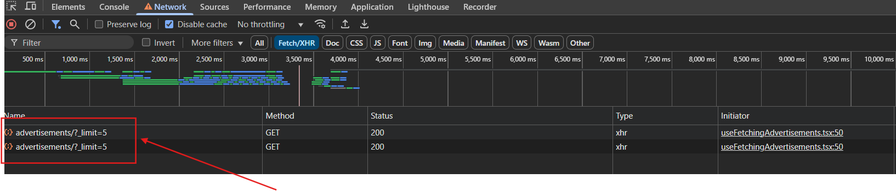

## Окружение:

- **ОС:** Windows 11
- **Браузер:** Chrome 133.0.6943.98 (Официальная сборка)
- **Тестируемый сайт:** [http://tech-avito-intern.jumpingcrab.com/](http://tech-avito-intern.jumpingcrab.com/)

## Создание объявления

### 1. **Не указана валюта в поле 'Цена' при создании объявления**

- **Описание:** В поле "Цена" при создании объявления отсутствует обозначение валюты. После публикации объявления отображается значок рубля, но при вводе пользователь не понимает, в какой валюте указывать цену.
- **Шаги воспроизведения:**
  1. Открыть окно создания объявления.
  2. Ввести цену в поле "Цена".
- **Ожидаемый результат:** Пользователь видит обозначение валюты уже при вводе (значок ₽ в поле).
- **Фактический результат:** Отсутствует значок валюты.
  
- **Приоритет:** Medium

---

### 2. **Ошибки валидации не отображаются при вводе некорректных данных в форму создания объявления**

- **Предусловие:** Открыта страница создания объявления.
- **Шаги воспроизведения:**
  1. В поле "Название" ввести 300 символов без пробелов.
  2. В поле "Цена" ввести `-500`.
  3. В поле "Описание" ввести только пробелы.
  4. В поле "Ссылка на изображение" ввести `abcd`.
  5. Нажать кнопку "Сохранить".
- **Ожидаемый результат:**
  - Объявление не сохраняется.
  - Под каждым полем с некорректными данными отображается сообщение об ошибке.
- **Фактический результат:**
  - Объявление сохраняется.
  - Ошибки валидации не отображаются.
- **Приоритет:** High

## Редактирование объявления

### 3. **Не указаны обязательные поля при редактировании объявления**

- **Предусловие:** Открыта страница с [объявлением](http://tech-avito-intern.jumpingcrab.com/advertisements/2).
- **Описание:** При редактировании объявления все поля, которые есть при создании объявления (Название, Цена, Описание, Ссылка на изображение), можно оставить пустыми. Хотя при создании объявления все поля имеют атрибут `required`, а раз поля идентичны, они не могут быть пустыми и при редактировании.
- **Шаги воспроизведения:**
  1. Перейти на страницу редактирования объявления.
  2. Оставить все обязательные поля пустыми.
  3. Нажать "Сохранить".
- **Ожидаемый результат:** У элементов `input` есть атрибут `required` как при создании, так и при редактировании объявления.
- **Фактический результат:** При редактировании объявления все поля можно оставить пустыми и сохранить.
  
  
- **Приоритет:** High

---

### 4. **Нет `placeholder` у полей при редактировании объявления**

- **Предусловие:** Открыта страница с [объявлением](http://tech-avito-intern.jumpingcrab.com/advertisements/2).
- **Шаги воспроизведения:**
  1. Перейти на страницу редактирования объявления.
  2. Очистить все поля.
  3. Проверить наличие `placeholder` в каждом поле.
- **Ожидаемый результат:** `placeholder` имеется во всех полях.
- **Фактический результат:** Отсутствует `placeholder` во всех полях.
  
- **Приоритет:** High

---

### 5. **Отсутствуют кнопки редактирования и сохранения объявления**

- **Предусловие:** Открыта страница с [объявлением](http://tech-avito-intern.jumpingcrab.com/advertisements/2).
- **Описание:** Вместо кнопок используются только иконки редактирования и сохранения, что не соответствует семантике и удобству использования. Скринридеры не будут их видеть и возможность перемещения с помощью Tab отсутсвует.
- **Шаги воспроизведения:**
  1. Перейти на страницу объявления.
  2. Нажать на иконку редактирования.
  3. Нажать на иконку сохранения.
- **Ожидаемый результат:** Должны быть кнопки с иконками внутри (`<button><svg></svg></button>`).
- **Фактический результат:** Есть только `svg`, обернутые в `div`, что делает функциональность менее доступной.
- **Приоритет:** Low
- **Скриншоты:**
  - Иконка редактирования  
    
  - Иконка сохранения  
    

---

### 6. **При редактировании объявления можно ввести `-` или `--`, что сохраняется как `0`**

- **Предусловие:** Открыта страница с [объявлением](http://tech-avito-intern.jumpingcrab.com/advertisements/2).
- **Описание:** В поле "Цена" можно ввести `-` или `--`, после чего при сохранении объявления отображается `0`, что некорректно.
- **Шаги воспроизведения:**
  1. Перейти в редактирование объявления.
  2. Ввести в поле "Цена" `-` или `--`.
  3. Нажать "Сохранить".
- **Ожидаемый результат:** В поле "Цена" допускаются только числовые значения больше или равные нулю.
- **Фактический результат:** Значение `-` или `--` сохраняется как `0`.
- **Приоритет:** Medium

---

### 7. **Некорректная обработка HTML-тегов в полях объявления**

- **Предусловие:** Открыта страница с [объявлением](http://tech-avito-intern.jumpingcrab.com/advertisements/2).
- **Описание:** В поле "Название" или "Описание" можно ввести HTML-теги (например, ``), что сохраняется и отображаются в объявлении как обычный текст, но это может привести к непредвиденным проблемам в виде рендеринга этих тегов.
- **Шаги воспроизведения:**
  1. Перейти в редактирование объявления.
  2. В поле "Название" или "Описание" ввести ``.
  3. Нажать "Сохранить".
  4. Открыть страницу объявления и проверить выполнение скрипта в консоли браузера.
- **Ожидаемый результат:** HTML-теги запрещены для ввода.
- **Фактический результат:** Теги сохраняются и отображаются как текст.
- **Приоритет:** Medium

## Выдача

### 8. **Поломанная вёрстка при длинном названии или описании карточки**

- **Описание:** Если название или описание в объявлении длинное, то карточка расширяется и залазит на соседнюю карточку. Надо уменьшить `max-width` у элемента `div class="css-1s2t5t1"`.
- **Шаги воспроизведения:**
  1. Перейти на страницу с объявлением с длинным названием или описанием.
  2. Проверить отображение карточек на странице.
- **Ожидаемый результат:** Вёрстка не ломается, карточка не меняет своей ширины.
- **Фактический результат:** Карточка расширяется и портит вид выдачи.
  
- **Приоритет:** Middle

---

### 9. **Неправильная фильтрация и сортировка объявлений по критериям 'Цена', 'Просмотры', 'Лайки'**

- **Описание:** При выборе любого фильтра объявлений, фильтрация и сортировка применяется некорректно.
- **Шаги воспроизведения:**
  1. Выбрать фильтр "Цена" (или любой другой).
  2. Применить сортировку (например, по возрастанию).
  3. Проверить как изменится порядок объявлений.
- **Ожидаемый результат:** В выдаче показываются отфильтрованные и сортированные по определённому критерию объявления (от большего к меньшему и наоборот).
- **Фактический результат:** При выборе любого фильтра объявления не сортируются должным образом.
  
  
- **Приоритет:** High

---

### 10. **Уходит с клиента по два запроса на сервер**

- **Описание:** При различных событиях на странице с объявлениями (обновление страницы, клик по кнопкам перехода по страницам, отображение количества объявлений на странице, фильтрация и сортировка, а также поиск (без нажатия на кнопку 'Найти')) отправляет на сервер по 2 запроса, они одинаковые.
- **Шаги воспроизведения:**
  1. Обновить страницу.
  2. Проверить запросы, которые отправляются на сервер (я проверяла через devTools).
- **Ожидаемый результат:** Запрос на сервер уходит один.
- **Фактический результат:** Запрос дублируется.
  
- **Приоритет:** Low

---

### 11. **Отсутствуют номера страниц в пагинации**

- **Описание:** На странице есть кнопки 'Предыдущая' и 'Следующая', но непонятно сколько всего страниц и на какой находится пользователь (если не посмотрит в полный адрес).
- **Шаги воспроизведения:**
  1. Перейти на страницу с объявлениями.
  2. Проверить наличие номеров страниц рядом с кнопками 'Предыдущая' и 'Следующая'.
- **Ожидаемый результат:** Кроме кнопок перелистывания страниц, есть пагинация с общим количеством страниц и обозначением текущей страницы.
- **Фактический результат:** Нет общего количества страниц и обозначения текущей страницы.
  
- **Приоритет:** High

---

### 12. **Не выделяется фильтр и сортировка при выборе пользователем**

- **Описание:** При выборе определенного фильтра или сортировки, никак не обозначена выбранная опция, непонятно, что за фильтр выбран или какая сортировка (видно по адресной строке, но туда пользователю не удобно смотреть и не надо).
- **Шаги воспроизведения:**
  1. Выбрать фильтр или сортировку.
  2. Проверить, изменяется ли визуальное выделение выбранного варианта.
- **Ожидаемый результат:** Выбранный фильтр и сортировка выделяются из списка.
- **Фактический результат:** Выбранный фильтр и сортировка такого же цвета, как и другие опции в списке.
  
- **Приоритет:** Medium

---

### 13. **Кнопка поиска 'Найти' не отправляет запрос на сервер при клике**

- **Описание:** Поиск срабатывает только при вводе текста в строке поиска. При нажатии на кнопку 'Найти' или клавишу Enter поиск не выполняется. Один из вариантов проверки - devTools во вкладке Network
- **Шаги воспроизведения:**
  1. Перейти на главную страницу.
  2. Ввести любое слово в строку поиска (например, `диван`).
  3. Нажать кнопку 'Найти' или клавишу Enter.
- **Ожидаемый результат:** При нажатии на кнопку 'Найти' или клавишу Enter выполняется поиск, отправляется запрос на сервер.
- **Фактический результат:** Запрос не отправляется, выдача не обновляется.
- **Приоритет:** Medium
- **Видео бага:** [Смотреть](https://disk.yandex.ru/i/ThMlW68CluL5vQ)

---

### 14. **Не обновляется поисковый запрос и выдача при выборе из выпадающего списка в строке поиска**

- **Описание:** Если выбрать значение из предложенного выпадающего списка в строке поиска, то в поле остаётся старое значение, и выдача объявлений не обновляется.
- **Шаги воспроизведения:**
  1. Ввести слово в строку поиска.
  2. Выбрать одно из предложенных значений в выпадающем списке.
- **Ожидаемый результат:** В поисковом поле отображается выбранное значение, обновляется выдача объявлений.
- **Фактический результат:** В поле поиска остаётся старое значение, выдача не обновляется.
- **Приоритет:** Medium
- **Видео бага:** [Смотреть](https://disk.yandex.ru/i/X-E3zHS7H59m0w)

---

### 15. **Нельзя удалить объявление**

- **Описание:** Отсутствует кнопка или функционал для удаления объявления.
- **Шаги воспроизведения:**
  1. Создать объявление.
  2. Перейти на страницу своего объявления.
  3. Попытаться найти кнопку удаления.
- **Ожидаемый результат:** У пользователя есть возможность удалить объявление.
- **Фактический результат:** Пользователь не может удалить объявление.
- **Приоритет:** High
